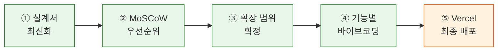

# Chapter 13. 블로그 확장 기능 구현 — A회차: 강의

> **미션**: 블로그에 확장 기능(댓글, 태그, 검색)을 추가하고 완성한다

---

## 바이브코딩 원칙 (이번 장)

이번 장의 바이브코딩은 “**확장 기능의 범위를 확정**하고, Copilot을 ‘자동 코더’가 아니라 **작업을 쪼개는 파트너**로 쓰는 것”이 핵심이다. 블로그 확장 기능은 범위를 못 잡으면 끝까지 못 간다.

1. **확장 범위를 문장 1개로**: “누가/무엇을/왜/어떻게” 한 줄로 정의하고, 나머지는 Non-goals로 뺀다.
2. **우선순위를 고정(MoSCoW)**: Must/Should/Could/Won’t를 먼저 나누고 Must만 구현한다.
3. **기능별로 프롬프트를 분리**: DB → CRUD → RLS → UX → 배포 순서로, 단계마다 Copilot 프롬프트를 새로 쓴다.
4. **컨텍스트는 ‘설계서’로 주입**: `ARCHITECTURE.md`와 `copilot-instructions.md`를 먼저 최신화하고, Copilot이 그 문서를 기준으로 답하게 한다.
5. **완료 기준(Definition of Done)**: “동작함”이 아니라 “테스트 시나리오 N개 통과 + 배포 확인”으로 끝낸다.

---

## Copilot 프롬프트 (복사/붙여넣기)

```text
너는 GitHub Copilot Chat이고, 내 `my-blog` 프로젝트에 확장 기능을 추가하는 걸 도와주는 PM+테크리드야.
기술 스택: Next.js(App Router) + Supabase + Tailwind + shadcn/ui.
목표: 1주(또는 수업 기간) 안에 댓글, 태그, 검색 기능을 추가하고 배포를 완성한다.

[프로젝트 개요]
- 한 줄 설명: Ch1~12에서 만든 블로그에 댓글·태그·검색 확장 기능을 추가하여 완성한다
- 타깃 사용자: 블로그 독자 / 블로그 작성자
- 핵심 화면 3개: (예: `/posts/*`, `/tags`, `/search`)

[현재 리포 상태]
- 있는 문서: `ARCHITECTURE.md`, `copilot-instructions.md` (Ch7~12에서 작성/갱신)
- 기존 기능: 블로그 글 CRUD + 이메일 인증 + RLS + Vercel 배포 완료
- 먼저 할 일: `ARCHITECTURE.md`와 `copilot-instructions.md`를 확장 기능에 맞게 최신화
- 구현 단계에서 할 일: 댓글/태그/검색 기능을 추가 + 테이블·RLS 확장 + 배포 점검

[요구 출력]
1) MoSCoW 표로 확장 기능 우선순위 정리(질문은 5개 이내)
2) 확장 기능 구현 로드맵(최대 6단계) + 각 단계의 산출물/검증 방법
3) 단계 1에 대한 Copilot 실행 프롬프트(구체적으로: 파일 경로/함수/쿼리 포함)
4) 배포 전 체크리스트(Vercel 환경변수, Supabase 설정 포함)

주의: 범위를 키우지 말고, Must만 끝내는 방향으로 제안해줘.
```

## 전체 워크플로



**표 13.1** 실행 단계 요약

| 단계 | 내용                              | 실행 |   절   |
| :--: | --------------------------------- | :--: | :----: |
|  ①   | ARCHITECTURE.md 최신화 + 확장 설계 |  🤖  | 13.1.1 |
|  ②   | MoSCoW 우선순위 분류               |  🤖  | 13.1.2 |
|  ③   | 확장 기능 체크리스트 작성           |  🤖  | 13.1.3 |
|  ④   | DB → CRUD → UI 순서로 확장 구현    |  🤖  |  13.2  |
|  ⑤   | Vercel 최종 배포 + 점검            |  🖱️  | 13.2.2 |

> 🖱️ = 사람이 직접 실행 · 🤖 = 바이브코딩 (Copilot)

---

## 학습목표

1. 기존 블로그의 ARCHITECTURE.md를 최신화하고 확장 기능 설계를 추가할 수 있다
2. MoSCoW 기법으로 확장 기능의 우선순위를 정하고 구현 범위를 확정할 수 있다
3. 기능별 Copilot 프롬프트 전략을 세우고 점진적으로 구현할 수 있다
4. Vercel에 최종 배포하고 환경 변수와 기능을 점검할 수 있다
5. README와 AI 사용 로그를 작성하여 프로젝트를 문서화할 수 있다

---

---

## 오늘의 미션 + 빠른 진단

> **오늘의 질문**: "블로그에 댓글·태그·검색 3가지를 추가할 때, 가장 먼저 해야 할 것은? UI? 테이블? 검색 로직?"

**빠른 진단** (1문항):

기존 블로그에 확장 기능을 추가할 때 올바른 순서는?

- (A) UI 디자인 → CRUD → 테이블 생성
- (B) 테이블 생성 + RLS → CRUD 함수 → UI → 배포
- (C) 전체 기능 한 번에 구현 → 배포

정답: (B) — 데이터 구조가 먼저 있어야 CRUD를 만들 수 있고, 기능이 완성된 후 UI를 다듬는다.

---

## 13.1 블로그 확장 기능 설계 `🤖 바이브코딩`

### 13.1.1 설계서 최신화 및 확장 설계 `🤖 바이브코딩`

Ch1~12를 거치며 블로그의 핵심 기능(글 CRUD, 이메일 인증, RLS, 배포)은 이미 완성되었다. 이제 ARCHITECTURE.md를 열고, 확장 기능(댓글, 태그, 검색)에 필요한 **새 테이블과 관계**를 설계에 추가할 차례이다.

ARCHITECTURE.md에서 가장 많이 바뀌는 부분은 **Data Model**이다. 기존 posts 테이블에 연결되는 새 테이블(comments, tags, post_tags)을 추가하고, 각 테이블의 RLS 정책을 설계한다.

```text
[Ch12까지의 Data Model]
## Data Model
- posts: id, title, content, user_id, created_at
  - RLS: SELECT 전체 허용, INSERT/UPDATE/DELETE는 본인만
- profiles: id, display_name, avatar_url, role
  - RLS: SELECT 전체 허용, UPDATE는 본인만

[Ch13 확장 후]
## Data Model (추가)
- comments: id, post_id(FK→posts), user_id(FK→profiles), content, created_at
  - RLS: SELECT 전체 허용, INSERT는 로그인 사용자, DELETE는 본인만
- tags: id, name(unique)
  - RLS: SELECT 전체 허용, INSERT는 로그인 사용자
- post_tags: post_id(FK→posts), tag_id(FK→tags), PRIMARY KEY(post_id, tag_id)
  - RLS: SELECT 전체 허용, INSERT/DELETE는 글 작성자만
```


> [버전 고정] Next.js 14.2.21, React 18.3.1, Tailwind CSS 3.4.17, @supabase/supabase-js 2.47.12, @supabase/ssr 0.5.2 기준으로 작성해줘.
> [규칙] App Router만 사용하고 next/router, pages router, 구버전 API는 사용하지 마.
> [검증] 불확실하면 현재 프로젝트 package.json 기준으로 버전을 먼저 확인하고 답해줘.
> "ARCHITECTURE.md를 검토해줘. Data Model 섹션에 확장 기능(댓글, 태그, 검색)에 필요한
> 새 테이블(comments, tags, post_tags)을 추가하고, 각 테이블에 RLS 정책을 표시해줘."

같은 방식으로 **Page Map**에는 확장 기능의 App Router 경로(`/posts/[id]`의 댓글 영역, `/tags`, `/search`)를, **User Flow**에는 댓글 작성·태그 필터링·검색 흐름을 반영한다.

copilot-instructions.md도 함께 업데이트한다. 기존 규칙에 확장 기능 관련 내용을 추가한다:

```markdown
## 확장 기능 규칙 (Ch13)

- comments 테이블: post_id(FK→posts), user_id(FK→profiles) 필수
- tags 테이블: name 컬럼에 UNIQUE 제약
- post_tags 테이블: 복합 PK (post_id, tag_id)
- 검색: Supabase textSearch 또는 ilike 사용
- RLS: 모든 새 테이블에 활성화
```

다음 체크리스트로 설계서를 점검한다.

**설계서 최신화 체크리스트**:

- [ ] **Page Map**: 확장 기능 경로(댓글, 태그, 검색)가 추가되어 있는가?
- [ ] **User Flow**: 댓글 작성, 태그 필터링, 검색 흐름이 반영되어 있는가?
- [ ] **Data Model**: 새 테이블(comments, tags, post_tags)의 컬럼, 관계(FK)가 구체적인가?
- [ ] **RLS 정책**: 새 테이블에 누가 읽고/쓰고/삭제할 수 있는지 명시했는가?
- [ ] **기존 테이블 영향**: posts 테이블에 변경이 필요한 부분은 없는가?
- [ ] **Design Tokens**: 댓글/태그/검색 UI에 사용할 컴포넌트가 정리되어 있는가?
- [ ] **copilot-instructions.md**: 확장 기능 규칙이 추가되어 있는가?

> **팁**: 5분간 설계서를 읽고 "댓글·태그·검색을 추가하려면 뭘 바꿔야 하나"를 메모해보자. 대부분 Data Model에 새 테이블을 추가하게 된다.

### 13.1.2 확장 기능 우선순위 정리 `🤖 바이브코딩`

> **원리 — MoSCoW 기법**
>
> - **Must have** — 없으면 블로그 확장이 성립 안 되는 핵심 (예: 댓글, 태그)
> - **Should have** — 있으면 좋지만 없어도 동작 (예: 검색, 좋아요)
> - **Could have** — 시간 남으면 추가 (예: 다크 모드, 알림)
> - **Won't have** — 이번 학기 안 함 (예: 실시간 채팅, RSS 피드)
>
> 핵심: **Must have만으로 의미 있는 확장**이어야 한다.


> [버전 고정] Next.js 14.2.21, React 18.3.1, Tailwind CSS 3.4.17, @supabase/supabase-js 2.47.12, @supabase/ssr 0.5.2 기준으로 작성해줘.
> [규칙] App Router만 사용하고 next/router, pages router, 구버전 API는 사용하지 마.
> [검증] 불확실하면 현재 프로젝트 package.json 기준으로 버전을 먼저 확인하고 답해줘.
> "블로그 확장 기능을 MoSCoW 기법으로 분류해줘.
> Must have는 댓글·태그, Should have는 검색·좋아요, Could have는 부가 기능으로 나눠줘."

**표 13.3** 블로그 확장 기능 필수/선택 분류

| 분류 | 기능 | 설명 |
|------|------|------|
| **Must** | 댓글 시스템 | 블로그 글에 댓글 작성/조회/삭제 (1:N 관계) |
| **Must** | 태그/카테고리 | 블로그 글에 태그 부여 + 태그별 필터링 (M:N 관계) |
| **Must** | RLS 확장 | 새 테이블(comments, tags, post_tags)에 RLS 정책 적용 |
| **Should** | 검색 기능 | 블로그 글 제목/내용 검색 |
| **Should** | 좋아요/이모지 반응 | 블로그 글에 좋아요 또는 이모지 반응 기능 |
| **Should** | 관리자 대시보드 | role에 'admin' 추가 + 관리자 전용 페이지 + 역할 기반 RLS |
| **Could** | 다크 모드 | 다크/라이트 테마 전환 |
| **Won't** | 실시간 채팅 | 이번 학기에는 구현하지 않음 |

> 댓글과 태그는 이번 블로그 확장의 **필수(Must)** 기능이다. Ch8~12에서 학습한 CRUD, RLS, 인증의 **종합 응용**으로서 기존 블로그에 새 테이블과 관계를 추가한다.

### 댓글 기능 구현 가이드

댓글은 블로그 글과 **1:N 관계**이다. 하나의 블로그 글에 여러 개의 댓글이 달릴 수 있다.

**① 테이블 설계**:

```sql
CREATE TABLE comments (
  id bigint GENERATED ALWAYS AS IDENTITY PRIMARY KEY,
  post_id bigint REFERENCES posts(id) ON DELETE CASCADE NOT NULL,
  user_id uuid REFERENCES profiles(id) ON DELETE CASCADE NOT NULL,
  content text NOT NULL,
  created_at timestamptz DEFAULT now()
);

ALTER TABLE comments ENABLE ROW LEVEL SECURITY;

-- 누구나 댓글 읽기
CREATE POLICY "누구나 댓글 읽기" ON comments
  FOR SELECT USING (true);

-- 로그인 사용자만 작성
CREATE POLICY "로그인 사용자만 댓글 작성" ON comments
  FOR INSERT WITH CHECK (auth.uid() = user_id);

-- 작성자만 삭제
CREATE POLICY "작성자만 댓글 삭제" ON comments
  FOR DELETE USING (auth.uid() = user_id);
```

**② CRUD 함수** (`lib/comments.ts`): `insert` (댓글 작성) + `select` (블로그 글별 댓글 조회) + `delete` (본인 댓글 삭제)

**③ UI 연결**: 블로그 글 상세 페이지(`/posts/[id]`)에 댓글 목록 + 댓글 입력 폼을 추가한다.


> [버전 고정] Next.js 14.2.21, React 18.3.1, Tailwind CSS 3.4.17, @supabase/supabase-js 2.47.12, @supabase/ssr 0.5.2 기준으로 작성해줘.
> [규칙] App Router만 사용하고 next/router, pages router, 구버전 API는 사용하지 마.
> [검증] 불확실하면 현재 프로젝트 package.json 기준으로 버전을 먼저 확인하고 답해줘.
> "기존 블로그의 posts 테이블과 1:N 관계인 comments 테이블을 만들어줘.
> 댓글 작성/조회/삭제 CRUD 함수를 lib/comments.ts에 만들고,
> 블로그 글 상세 페이지(/posts/[id])에 댓글 목록과 작성 폼을 추가해줘.
> RLS: 누구나 읽기, 로그인 사용자만 작성, 작성자만 삭제."

### 태그/카테고리 구현 가이드

태그는 블로그 글과 **M:N 관계**이다. 하나의 블로그 글에 여러 태그를 붙일 수 있고, 하나의 태그에 여러 블로그 글이 연결될 수 있다.

**① 테이블 설계**:

```sql
-- 태그 테이블
CREATE TABLE tags (
  id bigint GENERATED ALWAYS AS IDENTITY PRIMARY KEY,
  name text NOT NULL UNIQUE,
  created_at timestamptz DEFAULT now()
);

-- 블로그 글-태그 연결 테이블 (M:N)
CREATE TABLE post_tags (
  post_id bigint REFERENCES posts(id) ON DELETE CASCADE NOT NULL,
  tag_id bigint REFERENCES tags(id) ON DELETE CASCADE NOT NULL,
  PRIMARY KEY (post_id, tag_id)
);

ALTER TABLE tags ENABLE ROW LEVEL SECURITY;
ALTER TABLE post_tags ENABLE ROW LEVEL SECURITY;

-- 누구나 태그 조회
CREATE POLICY "누구나 태그 읽기" ON tags
  FOR SELECT USING (true);

-- 로그인 사용자만 태그 생성
CREATE POLICY "로그인 사용자만 태그 생성" ON tags
  FOR INSERT WITH CHECK (auth.uid() IS NOT NULL);

-- 누구나 글-태그 연결 조회
CREATE POLICY "누구나 글-태그 읽기" ON post_tags
  FOR SELECT USING (true);

-- 글 작성자만 태그 부여/제거
CREATE POLICY "글 작성자만 태그 관리" ON post_tags
  FOR ALL USING (
    EXISTS (
      SELECT 1 FROM posts WHERE id = post_id AND user_id = auth.uid()
    )
  );
```

**② CRUD 함수** (`lib/tags.ts`): `getTags` (전체 태그 조회) + `addTagToPost` (글에 태그 부여) + `removeTagFromPost` (글에서 태그 제거) + `getPostsByTag` (태그별 글 필터링)

**③ UI 연결**: 블로그 글 작성/수정 시 태그를 선택하는 UI + `/tags` 페이지에서 태그별 글 목록 표시


> [버전 고정] Next.js 14.2.21, React 18.3.1, Tailwind CSS 3.4.17, @supabase/supabase-js 2.47.12, @supabase/ssr 0.5.2 기준으로 작성해줘.
> [규칙] App Router만 사용하고 next/router, pages router, 구버전 API는 사용하지 마.
> [검증] 불확실하면 현재 프로젝트 package.json 기준으로 버전을 먼저 확인하고 답해줘.
> "블로그에 태그/카테고리 기능을 만들어줘.
> tags 테이블: id + name(UNIQUE). post_tags 테이블: post_id + tag_id (복합 PK).
> CRUD 함수를 lib/tags.ts에 만들고, 글 작성 시 태그 선택 UI와
> /tags 페이지에서 태그별 글 목록을 보여줘.
> RLS: 누구나 읽기, 로그인 사용자만 태그 생성, 글 작성자만 태그 부여/제거."

### 검색 기능 구현 가이드

블로그 글이 많아지면 검색 기능이 필요하다. Supabase에서는 **`ilike`** (대소문자 무시 패턴 매칭) 또는 **Full Text Search** (`textSearch`)를 사용할 수 있다. 여기서는 간단한 `ilike` 방식을 먼저 구현한다.

**① 검색 쿼리**:

```typescript
// lib/search.ts
import { createBrowserClient } from '@supabase/ssr';

export async function searchPosts(query: string) {
  const supabase = createBrowserClient(
    process.env.NEXT_PUBLIC_SUPABASE_URL!,
    process.env.NEXT_PUBLIC_SUPABASE_ANON_KEY!
  );

  const { data, error } = await supabase
    .from('posts')
    .select('id, title, content, created_at, profiles(display_name)')
    .or(`title.ilike.%${query}%,content.ilike.%${query}%`)
    .order('created_at', { ascending: false });

  return { data, error };
}
```

`ilike`는 SQL의 `LIKE`와 같지만 대소문자를 구분하지 않는다. `%`는 "아무 문자"를 뜻하는 와일드카드이다.

**② 검색 UI**: `/search` 페이지에 검색 입력 폼 + 결과 목록을 표시한다. 검색어를 URL 쿼리 파라미터(`?q=검색어`)로 전달하면 공유도 가능하다.

**③ 검색 결과 하이라이팅**: 검색어와 일치하는 부분을 `<mark>` 태그로 강조하면 사용자 경험이 좋아진다.


> [버전 고정] Next.js 14.2.21, React 18.3.1, Tailwind CSS 3.4.17, @supabase/supabase-js 2.47.12, @supabase/ssr 0.5.2 기준으로 작성해줘.
> [규칙] App Router만 사용하고 next/router, pages router, 구버전 API는 사용하지 마.
> [검증] 불확실하면 현재 프로젝트 package.json 기준으로 버전을 먼저 확인하고 답해줘.
> "블로그 검색 기능을 구현해줘.
> 1. lib/search.ts: posts 테이블에서 title, content를 ilike로 검색하는 함수
> 2. app/search/page.tsx: 검색 입력 폼 + 결과 목록 (URL 쿼리 파라미터 사용)
> 3. 검색어 하이라이팅 (일치 부분 강조)
> 4. 검색 결과에 글 제목, 작성자, 날짜 표시
> copilot-instructions.md의 디자인 토큰을 따라줘."

### 13.1.3 확장 기능 범위 확정 `🤖 바이브코딩`

> **원리 — 점진적 확장**
>
> 기존에 동작하는 블로그가 있으므로 "새로 만드는" 것이 아니라 "기능을 추가하는" 것이다. Must have 항목만 확실히 구현하고, 나머지는 시간이 남으면 추가한다.

**표 13.4** 블로그 확장 기능 체크리스트

| 구분 | 기능                                | 완료 |
| ---- | ----------------------------------- | :--: |
| 댓글 | comments 테이블 생성 + RLS          |  ☐   |
| 댓글 | 댓글 작성/조회/삭제 CRUD            |  ☐   |
| 댓글 | 블로그 글 상세에 댓글 UI 연결       |  ☐   |
| 태그 | tags + post_tags 테이블 생성 + RLS  |  ☐   |
| 태그 | 글 작성 시 태그 선택 UI             |  ☐   |
| 태그 | 태그별 글 필터링 페이지             |  ☐   |
| 검색 | 블로그 글 제목/내용 검색 기능       |  ☐   |
| 배포 | Vercel 재배포 + 전 기능 동작 확인   |  ☐   |

확장 범위를 정할 때 자주 하는 실수:

- **"기존 코드를 처음부터 다시 만들고 싶어"** → 이미 동작하는 블로그를 버리지 않는다. 확장만 한다.
- **"댓글에 대댓글도 넣고 싶어"** → 대댓글은 재귀 관계로 복잡하다. 1단계 댓글만 Must이다.
- **"디자인을 예쁘게 하고 싶어"** → 기능이 먼저다. Tailwind 기본 스타일만으로도 충분히 깔끔하다. UI 다듬기는 기능 완성 후에 한다.

> **팁**: 확장 범위를 너무 크게 잡지 말자. 댓글 + 태그만 제대로 구현해도 훌륭한 블로그이다.

---

## 13.2 바이브코딩으로 확장 구현 `🤖 바이브코딩`

### 13.2.1 기능별 Copilot 프롬프트 전략 `🤖 바이브코딩`

확장 기능 체크리스트의 기능을 하나씩 구현한다. 기존 블로그에 인증과 기본 CRUD가 이미 있으므로, 다음 순서를 권장한다.

**표 13.5** 블로그 확장 권장 구현 순서 4단계

| 단계 | 작업                               | 이유                                            | 예상 소요 |
| :--: | ---------------------------------- | ----------------------------------------------- | :-------: |
|  1   | 새 테이블 생성 + RLS               | 댓글·태그 데이터 구조가 먼저 있어야 한다        |   짧음    |
|  2   | 댓글 CRUD + UI                     | 블로그의 핵심 확장 — 가장 많은 시간을 여기에 쓴다 |   길다    |
|  3   | 태그/카테고리 + 검색               | 글 분류와 탐색 기능 추가                        |   보통    |
|  4   | UI 정리 + 배포 + 테스트            | Vercel에 올리고 실제 URL에서 확인한다           |   짧음    |

이 순서가 중요한 이유: 1단계(DB)가 없으면 2~3단계(CRUD)를 만들 수 없다. 4단계(UI 정리)는 기능이 동작한 후에 해야 한다 — 동작하지 않는 기능의 UI를 꾸미는 것은 시간 낭비이다.

각 단계별 프롬프트 예시:

> **Copilot 프롬프트 (1단계 — 확장 테이블)**
> "Supabase SQL Editor에서 실행할 comments, tags, post_tags 테이블 생성 SQL을 작성해줘.
> comments: id(bigint, PK), post_id(FK→posts), user_id(FK→profiles), content(text), created_at.
> tags: id(bigint, PK), name(text, UNIQUE). post_tags: post_id + tag_id (복합 PK).
> 모든 테이블에 RLS를 활성화하고 적절한 정책을 설정해줘."

> **Copilot 프롬프트 (2단계 — 댓글 CRUD)**
> "블로그 글 상세 페이지(/posts/[id])에 댓글 기능을 추가해줘.
> lib/comments.ts에 CRUD 함수를 만들고, 댓글 목록 + 작성 폼 컴포넌트를 추가해줘.
> 로그인한 사용자만 댓글 작성 가능, 본인 댓글만 삭제 가능.
> copilot-instructions.md를 참고해줘."

> **Copilot 프롬프트 (3단계 — 태그 + 검색)**
> "블로그에 태그 기능을 추가해줘. 글 작성/수정 시 태그를 선택하는 UI를 만들고,
> /tags 페이지에서 태그별로 글을 필터링할 수 있게 해줘.
> /search 페이지에서 제목/내용으로 글을 검색하는 기능도 추가해줘."

**좋은 프롬프트 vs 나쁜 프롬프트**:

```text
나쁜 프롬프트:
"댓글 기능 만들어줘"

좋은 프롬프트:
"블로그 글 상세 페이지(/posts/[id])에 댓글 기능을 추가해줘.
- Supabase의 comments 테이블에서 post_id로 필터링하여 댓글 조회
- @supabase/ssr의 createBrowserClient 사용 (클라이언트 컴포넌트)
- Tailwind CSS로 댓글 목록 + 작성 폼 레이아웃
- 로그인한 사용자만 작성 가능, 본인 댓글만 삭제 가능
- copilot-instructions.md의 디자인 토큰을 따라줘"
```

좋은 프롬프트의 공통점: **기술 스택 명시** + **데이터 소스 지정** + **UI 구조 설명** + **프로젝트 규칙 참조**.

나쁜 프롬프트가 문제인 이유는 AI가 "추측"해야 할 부분이 많기 때문이다. "댓글 기능 만들어줘"라고 하면 AI는 테이블 구조를 추측하고, 기존 코드를 추측하고, UI를 추측한다. 추측이 많을수록 AI 3대 한계(버전 불일치, 컨텍스트 소실, 환각)에 빠질 확률이 높아진다.

**기능별 프롬프트 작성 팁** — 프롬프트에 반드시 포함할 정보:

**표 13.6** 기능별 프롬프트 필수 포함 정보

| 기능        | 프롬프트에 포함할 정보                                       |
| ----------- | ------------------------------------------------------------ |
| 테이블 생성 | 테이블명, 컬럼(타입), FK 관계, RLS 정책                      |
| 인증        | OAuth 제공자, 콜백 URL, 세션 관리 방식                       |
| 읽기(R)     | 테이블명, 정렬 기준, 필터 조건, 표시 필드                    |
| 쓰기(C)     | 입력 필드, 유효성 검증 조건, 성공 후 이동 경로               |
| 수정(U)     | 수정 대상 식별 방법(id), 수정 가능 필드, 권한 확인           |
| 삭제(D)     | 삭제 확인 UI, 삭제 권한, 삭제 후 동작                        |
| 레이아웃    | 반응형 기준(md:), 컴포넌트 구조, 디자인 토큰                 |

**AI 생성 코드 읽기 포인트**: AI가 코드를 생성하면, 다음 4가지를 반드시 확인한다.

1. **import 경로**: `next/router`(Pages Router)가 아닌 `next/navigation`(App Router)을 사용하는가?
2. **Supabase 클라이언트**: `createClient`(구버전)가 아닌 `createServerClient` 또는 `createBrowserClient`(@supabase/ssr)를 사용하는가?
3. **'use client' 지시어**: 상태(useState)나 이벤트 핸들러(onClick)가 있는 컴포넌트에 `'use client'`가 선언되어 있는가?
4. **하드코딩된 값**: Supabase URL이나 키가 코드에 직접 적혀 있지 않은가? 반드시 `process.env.NEXT_PUBLIC_*`로 참조해야 한다.

이 4가지는 AI가 가장 자주 틀리는 부분이다. 코드가 길어도 이 4곳만 확인하면 대부분의 문제를 잡을 수 있다.

### 13.2.2 점진적 구현과 배포 `🤖→🖱️`

한 번에 모든 기능을 만들지 않는다. **기능 하나를 만들고, 테스트하고, 커밋하고, 배포한다**. 이것을 반복한다. 이 방식의 장점은 두 가지이다:

1. **문제 추적이 쉽다**: 에러가 나면 방금 추가한 기능이 원인이다. 한 번에 5개 기능을 넣으면 어디가 문제인지 찾기 어렵다.
2. **항상 배포 가능하다**: 기능을 하나 추가할 때마다 배포하므로, 중간에 멈춰도 "동작하는 앱"이 있다.

**표 13.7** 기능당 구현 체크리스트

| 순서 | 항목                                          | 확인 |
| :--: | --------------------------------------------- | :--: |
|  1   | AI에게 프롬프트 작성                          |  ☐   |
|  2   | 생성된 코드 읽기 — import 경로, API 버전 확인 |  ☐   |
|  3   | `npm run dev`로 로컬 테스트                   |  ☐   |
|  4   | 에러 있으면 수정 (13.2.3 참고)                |  ☐   |
|  5   | `git add . && git commit -m "기능명"`         |  ☐   |
|  6   | `git push` → Vercel 자동 배포                 |  ☐   |
|  7   | 배포 URL에서 동작 확인                        |  ☐   |

**Copilot로 여러 파일 작업**: 여러 파일에 걸친 작업(예: 새 페이지 + 컴포넌트 + API 연동)은 Copilot이 효과적이다. AI가 프로젝트 파일을 탐색하고, 코드를 생성하고, 여러 파일을 한 번에 수정할 수 있다.

AI가 여러 파일을 수정할 때 주의할 점:

- AI가 생성한 **모든 파일을 확인**한다 — 파일을 새로 만들었으면 경로가 맞는지, 기존 파일을 수정했으면 의도한 부분만 바뀌었는지 확인
- AI가 **패키지를 새로 설치**했으면 package.json에 버전이 올바른지 확인
- AI가 제안하는 터미널 명령어(npm install, git 등)는 실행 전에 한 번 읽어보기

**copilot-instructions.md 업데이트**: 기능을 추가할 때마다 copilot-instructions.md에 새로운 규칙이 필요한지 확인한다. 예를 들어 comments 테이블을 만들었다면 "comments 테이블의 컬럼 목록"을 추가하고, RLS 정책을 설정했다면 "RLS 정책 요약"을 추가한다. 이 문서가 최신 상태를 유지할수록 AI의 다음 출력이 정확해진다.

> copilot-instructions.md는 Copilot이 프로젝트를 이해하기 위해 자동으로 읽는 설정 파일이다. 프로젝트의 기술 스택, 디자인 토큰, 컴포넌트 규칙, Supabase 설정 등 **항상 적용되어야 할 규칙**을 모두 이 파일에 정리한다.

### 13.2.3 에러 대응과 디버깅 `🤖 바이브코딩`

구현 중 에러는 반드시 발생한다. 당황하지 말고 패턴별로 대응하자. Ch12에서 배운 에러 처리의 핵심 원칙을 떠올려보면: 에러 메시지를 읽고, 유형을 분류하고, 해당 유형에 맞는 조치를 취한다.

**표 13.8** 흔한 에러 패턴 5가지

|  #  | 에러 패턴              | 원인                                | 대응 방법                             |
| :-: | ---------------------- | ----------------------------------- | ------------------------------------- |
|  1  | `Module not found`     | import 경로 오류 또는 패키지 미설치 | 경로 확인, `npm install 패키지명`     |
|  2  | `RLS policy violation` | RLS 정책 누락 또는 조건 오류        | Supabase 대시보드에서 정책 확인       |
|  3  | `NEXT_PUBLIC_ 없음`    | 환경 변수명에 접두사 누락           | 클라이언트용은 `NEXT_PUBLIC_` 필수    |
|  4  | `hydration mismatch`   | 서버/클라이언트 렌더링 불일치       | `'use client'` 확인, 동적 데이터 처리 |
|  5  | `Auth error`           | 설정 불일치                         | Supabase Auth 설정 확인               |

에러 #2(RLS)와 #5(Auth)는 **코드 문제가 아니라 설정 문제**이다. 코드를 아무리 고쳐도 해결되지 않으므로, Supabase 대시보드에서 설정을 확인해야 한다. AI에게 질문할 때도 "코드를 고쳐줘"가 아니라 "이 RLS 정책이 맞는지 확인해줘"라고 질문하는 것이 효과적이다.

**디버깅 프롬프트 전략**:

에러가 발생하면 AI에게 다시 질문한다. 이때 **에러 메시지 전체**를 붙여넣는 것이 핵심이다.

```text
나쁜 디버깅 프롬프트:
"안 돼. 에러 남. 고쳐줘."

좋은 디버깅 프롬프트:
"다음 에러가 발생했어:
[에러 메시지 전체 붙여넣기]
현재 파일은 app/posts/[id]/page.tsx이고, Supabase에서 comments 테이블을 읽는 컴포넌트야.
RLS 정책은 누구나 SELECT 가능하게 설정했어."
```

좋은 디버깅 프롬프트의 3요소: **에러 메시지 원문** + **현재 파일/컨텍스트** + **의도한 동작**.

**AI가 같은 실수를 반복할 때**: 같은 에러를 AI에게 3번 이상 물어봐도 해결이 안 된다면, AI가 해당 문제의 컨텍스트를 충분히 이해하지 못한 것이다. 이때는 다음을 시도한다:

1. **새 대화 시작** — 이전 대화의 잘못된 컨텍스트가 영향을 줄 수 있다
2. **관련 파일 전체를 첨부** — 에러가 발생한 파일뿐 아니라 관련 파일(레이아웃, 설정 등)도 함께 제공
3. **공식 문서 참조 요청** — "Next.js 공식 문서의 Server Components 섹션을 참고해서 답해줘"

---

## 워크숍: 설계서 최신화 + 확장 범위 확정

> **팁**: 이 시간에는 각자 블로그 프로젝트의 설계서를 열고 확장 설계를 시작한다. 어떤 확장 기능을 넣을지, 설계서에 빠진 부분이 없는지 점검하자.

**워크숍 순서**:

① ARCHITECTURE.md를 열고, 설계서 최신화 체크리스트(13.1.1)로 점검한다

② 확장 기능 체크리스트(표 13.4)를 확인하고, Must have 기능을 확정한다

③ copilot-instructions.md에 확장 기능 규칙(댓글·태그·검색 테이블 정보)을 추가한다

④ 권장 구현 순서(표 13.5)에 따라 첫 번째 기능(확장 테이블 생성)을 시작한다

> **실습 안내**: 첫 번째 기능(comments, tags 테이블 생성 + RLS)을 먼저 구현하고, 이후 기능은 체크리스트 순서대로 확장한다.

---

## 13.3 컨텍스트 업데이트 `🤖 바이브코딩`

Ch13은 지금까지 쌓아온 모든 컨텍스트를 **총정리**하는 장이다. context.md를 최신 상태로 갱신하고, todo.md에서 남은 작업을 확인하는 것이 블로그 확장 완성의 출발점이다.

**세션 시작 프롬프트** — Ch13 작업을 시작할 때:

```text
#file:context.md #file:todo.md #file:ARCHITECTURE.md #file:copilot-instructions.md

Ch13 블로그 확장 기능 구현을 시작하려고 해.
1) context.md에서 Ch8~12까지의 모든 기술 결정 사항과 해결된 이슈를 확인해줘
2) todo.md에서 미완료 항목을 정리하고 우선순위를 매겨줘
3) ARCHITECTURE.md가 현재 코드와 일치하는지 검토해줘
4) 확장 기능(댓글, 태그, 검색)에 필요한 변경사항을 제안해줘
```

**이 장에서 context.md에 추가할 내용**:

```markdown
## 블로그 확장 상태 (Ch13)

- 확장 범위: 댓글 + 태그/카테고리 + 검색
- ARCHITECTURE.md 최신화: 확장 테이블(comments, tags, post_tags) 추가 완료
- copilot-instructions.md 보완: 확장 기능 규칙, RLS 패턴 추가
- 통합 테스트: 댓글 플로우 / 태그 필터 플로우 / 검색 플로우 확인

## 남은 작업 (Ch13 이후)

- [Should/Could have 기능 목록]
- 배포 전 최종 점검 사항
```

**세션 종료 프롬프트** — Ch13 작업은 특히 **전체 정리**가 중요하다:

```text
Ch13 블로그 확장 기능 구현을 마무리하려고 해.
1) context.md를 전체 갱신해줘 — Ch1~13까지의 모든 내용이 최신 상태인지 확인
2) todo.md에서 완료 항목을 체크하고 최종 진행률을 갱신해줘
3) ARCHITECTURE.md에 확장 기능으로 추가된 페이지나 컴포넌트를 반영해줘
4) 남은 작업(Should/Could have)을 todo.md 하단에 정리해줘
```

> **팁**: Ch13 종료 시점의 context.md가 가장 완성도 높은 "블로그 프로젝트 기억"이다. 이후 유지보수나 기능 추가 시 이 파일 하나로 Copilot에게 프로젝트 전체를 전달할 수 있다.

---

## 핵심 정리 + B회차 과제 스펙

### 이번 시간 핵심 3가지

1. **설계서 최신화**: 기존 블로그 설계서에 확장 테이블(comments, tags, post_tags)과 RLS 정책을 추가한다
2. **확장 범위 확정**: Must have(댓글, 태그)를 먼저 구현하고, Should have(검색, 좋아요)는 시간이 남으면 추가한다
3. **점진적 구현**: 확장 테이블 → CRUD → UI → 배포 순서로, 기능 하나씩 만들고 테스트하고 커밋한다

### B회차 과제 스펙

**블로그 확장 기능 구현 + 배포**:

① ARCHITECTURE.md 최신화 (확장 테이블 + RLS 추가)
② 댓글 기능 구현 (comments 테이블 + RLS + CRUD + UI)
③ 태그/카테고리 기능 구현 (tags + post_tags 테이블 + 필터링)
④ 검색 기능 구현 (제목/내용 검색 + 검색 페이지)
⑤ Vercel 배포 + 전 기능 동작 확인
⑥ README.md + AI_LOG.md 작성
⑦ 배포 URL + GitHub 저장소 제출

### Skills 활용 가이드 (B회차 적용)

- `nextjs-basic-check`: App Router 경로, 컴포넌트 경계, `next/navigation` import 규칙을 최종 점검한다.
- `api-safety-check`: 인증/CRUD/RLS/폼 검증에서 에러 처리 누락과 위험한 패턴을 점검한다.
- 권장 타이밍: 확장 기능 완성 후, 배포 전 최종 점검 단계.

**스타터 코드**: Ch12까지 완성한 블로그 프로젝트를 그대로 사용한다. 별도 스타터 코드 없이 기존 프로젝트에 확장 기능을 추가한다.

---

## Exit ticket

블로그에 댓글 기능을 추가할 때 올바른 순서를 고르라:

- (A) 댓글 UI 만들기 → comments 테이블 생성 → CRUD 함수 작성
- (B) comments 테이블 생성 + RLS → CRUD 함수 작성 → 댓글 UI 연결
- (C) CRUD 함수 작성 → comments 테이블 생성 → 댓글 UI 만들기

정답: (B) — 테이블이 먼저 있어야 CRUD 함수를 만들 수 있고, CRUD가 동작해야 UI를 연결할 수 있다.

---

## 현재 상태

- 마지막 작업일: 2026-02-26
- 완료된 작업: 2026년 기준 교육 자료 업데이트 및 동기화 (Next.js 14.2.21, Tailwind 3.4.17 기준)
- 작업자: Bive AI (GitHub Copilot)

---

## 학습 체크리스트

**수업 전 준비**:

- [ ] Ch12까지 완성한 블로그 프로젝트 확인
- [ ] ARCHITECTURE.md 최신 상태 확인
- [ ] Supabase 대시보드 접속 확인

**자기 점검**:

- [ ] ARCHITECTURE.md에 확장 테이블(comments, tags, post_tags)을 추가했는가
- [ ] 확장 기능 체크리스트를 확인했는가 (Must have: 댓글 + 태그)
- [ ] 확장 테이블 생성을 시작했는가
- [ ] context.md에 확장 기능 관련 내용이 반영되었는가
- [ ] todo.md의 최종 진행률이 갱신되었는가
